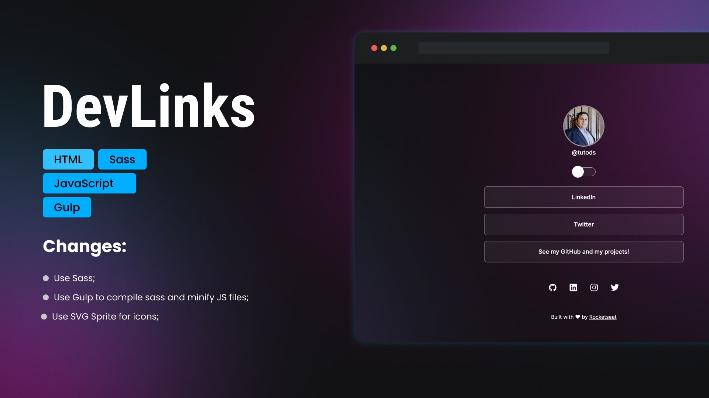

# DevLinks

This repo contains the **DevLinks** project following the **[Rocketseat](https://lp.rocketseat.com.br/devlinks/inscricao)** course.

As usually, on this repo you can found some changes when compare with the course project.

## 🛠 Skills

![html][html] ![sass][sass] ![javascript][javascript] ![gulp][gulp]

## 📄 Roadmap

The goal of **DevLinks** is build your first website, but, in my case, I have a few changes when comparing with the course:
- [x] Use Gulp;
- [x] Use Sass;
- [x] Use SVG Sprite for the icons;

### What is missing?

-   [ ] **ESLint** configuration;
-   [ ] Improve SEO;
-   [ ] Create config to optimize and convert images to `.webp`.

## 🔗 More About Me

[html]: https://img.shields.io/badge/html-1E4174?style=for-the-badge&logo=html5&logoColor=white
[sass]: https://img.shields.io/badge/sass-1E4174?style=for-the-badge&logo=sass&logoColor=white
[javascript]: https://img.shields.io/badge/javascript-1E4174?style=for-the-badge&logo=javascript&logoColor=white
[gulp]: https://img.shields.io/badge/gulp-1E4174?style=for-the-badge&logo=gulp&logoColor=white